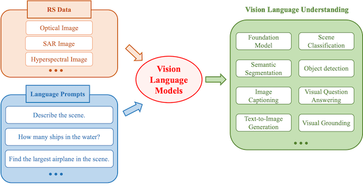
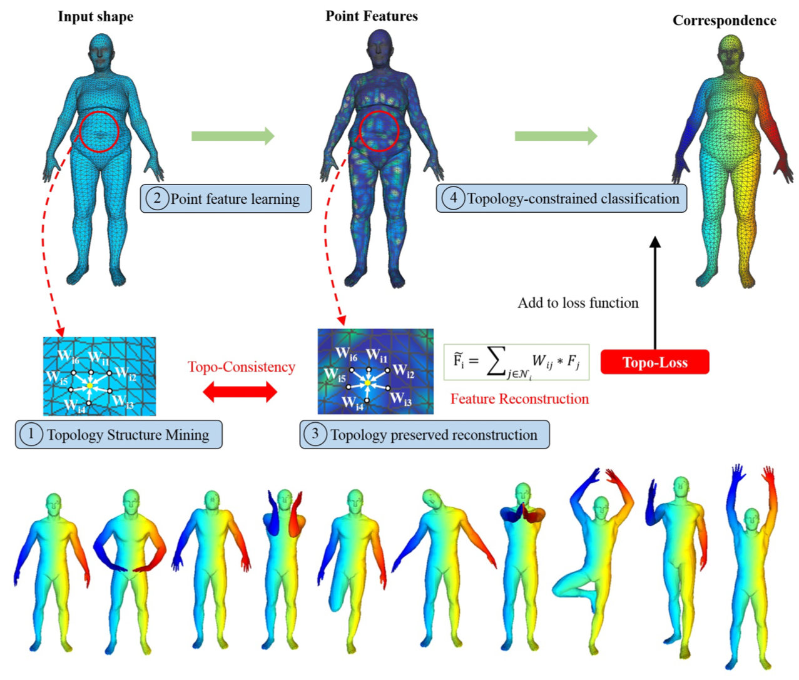
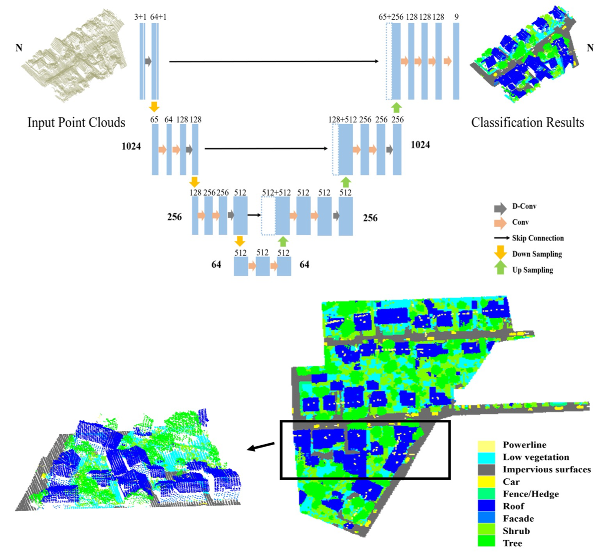








  I am currently a Postdoctoral Associate at the 
  <a href="https://nyuair.github.io/website/">NYU Embodied AI and Robotics Lab</a> at New York University (NYU) 
  and the 
  <a href="https://nyuad.nyu.edu/en/research/faculty-labs-and-projects/center-for-artificial-intelligence-and-robotics.html">
    Center for AI and Robotics (CAIR)
  </a> at NYU Abu Dhabi (NYUAD), working under the supervision of <a href="https://nyuad.nyu.edu/en/academics/divisions/engineering/faculty/yi-fang.html"> Prof. Yi Fang</a>. 
  I am also a Visiting Research Fellow at the 
  <a href="https://wang.hms.harvard.edu/">Harvard AI and Robotics Lab</a> at Harvard University, 
  under the guidance of <a href="https://wang.hms.harvard.edu/team/dr-wang/"> Prof. Mengyu Wang</a>. I earned my Ph.D. in Cartography and Geographic Information System in 2021 from the 
  University of Chinese Academy of Sciences (UCAS) and the Aerospace Information Research Institute (AIR), 
  Chinese Academy of Sciences (CAS), where I was admitted through recommendation. 
  During my doctoral studies, I had the privilege of being a visiting scholar at the 
  <a href="https://ai4ce.github.io/">NYU AI4CE Lab</a> at New York University (NYU), mentored by <a href="https://engineering.nyu.edu/faculty/chen-feng"> Prof. Chen Feng</a>.

My research is driven by a vision to create AI systems that are reliable, equitable, and beneficial to society. This mission guides my exploration of both foundational advancements in AI and their interdisciplinary applications. I focus on 2D/3D computer vision, multimodal large language models, and spatiotemporal data mining, applying these technologies to address complex challenges in robotics, remote sensing, healthcare, geospatial analysis, and urban planning. With a commitment to fostering trustworthy AI systems that prioritize accuracy, efficiency, robustness, and fairness, my work bridges theoretical innovation with practical impact. To date, I have published over 50 research papers in top-tier conferences such as NeurIPS, ICCV, ECCV, AAAI, ICRA, and IROS, as well as leading journals like TVCG, TCSVT, TMM, TIM, GRSM, ISPRS, and ESSD.

<!-- # 🔥 News
- *2022.02*: &nbsp;🎉🎉 Congcong Wen dolor sit amet, consectetur adipiscing elit. Vivamus ornare aliquet ipsum, ac tempus justo dapibus sit amet. 
- *2022.02*: &nbsp;🎉🎉 Congcong Wen dolor sit amet, consectetur adipiscing elit. Vivamus ornare aliquet ipsum, ac tempus justo dapibus sit amet. 
 -->
# 🔥 News

  <ul class="news-list">
    <li>2024.01: &nbsp;🎉🎉 One paper is accepted by IEEE TCSVT.</li>
    <li>2024.12: &nbsp;🎉🎉 One paper is accepted by ICASSP 2025.</li>
    <li>2024.12: &nbsp;🎉🎉 One paper is accepted by AAAI 2025.</li>
    <li>2024.12: &nbsp;🎉🎉 One paper is accepted by IEEE GRSL.</li>
    <li>2024.09: &nbsp;🎉🎉 One paper is accepted by NeurIPS 2024.</li>
    <li>2024.08: &nbsp;🎉🎉 Five papers are accepted by ICPR 2024, including one Oral.</li>
    <li>2024.06: &nbsp;🎉🎉 Two Oral papers are accepted by IROS 2024.</li>
    <li>2024.06: &nbsp;🎉🎉 I serve as Session Co-Chair for ICRA 2024.</li>
    <li>2024.03: &nbsp;🎉🎉 One paper is accepted by IEEE GRSM (Impact Factor: <strong style="color: red; font-weight: bold;">16.2</strong>).</li>
    <li>2024.02: &nbsp;🎉🎉 One paper is accepted by ESSD (Impact Factor: <strong style="color: red; font-weight: bold;">11.2</strong>).</li>
    <li>2024.02: &nbsp;🎉🎉 One paper is accepted by IEEE TIM.</li>
    <li>2024.01: &nbsp;🎉🎉 One paper is accepted by ISPRS P&RS (Impact Factor: <strong style="color: red; font-weight: bold;">10.6</strong>).</li>
    <li>2024.09: &nbsp;🎉🎉 One paper is accepted by ICRA 2024.</li>
    <!-- 更多内容 -->
  </ul>

# 📝 Publications 

<h2 id="-speech-synthesis"> 🤖 Robotics</h2>

<h2 id="-speech-synthesis"> 🌏 Remote Sensing</h2>

<h2 id="-speech-synthesis"> 🏥 HealthCare</h2>

<h2 id="-speech-synthesis"> 📑 Geospatial Analysis</h2>

<h2 id="-speech-synthesis"> 🏙 Ubran Planing</h2>

IEEE GRSM 2024

[Vision-Language Models in Remote Sensing: Current Progress and Future Trends](https://ieeexplore.ieee.org/document/10506064)

Xiang Li\*, **Congcong Wen\***, Yuan Hu\*, Zhenghang Yuan, Xiao Xiang Zhu.

TVCG 2019

[Topology Constrained Shape Correspondence.](https://ieeexplore.ieee.org/document/9091324)

Xiang Li\*, **Congcong Wen\***, Lingjing Wang, Yi Fang.

ISPRS 2020

[Directionally Constrained Fully Convolutional Neural Network For Airborne Lidar Point Cloud Classification.](https://www.sciencedirect.com/science/article/abs/pii/S0924271620300381)

**Congcong Wen**, Lina Yang, Ling Peng, Xiang Li, Tianhe Chi.

<a href="https://github.com/lixiang-ucas/D-FCN"><strong>Code</strong></a> <strong>| Citations: 118</strong>

STOEN 2019

[A Novel Spatiotemporal Convolutional Long Short-term Neural Network For Air Pollution Prediction.](https://www.sciencedirect.com/science/article/abs/pii/S0048969718344413)

**Congcong Wen**, Shufu Liu, Xiaojing Yao, Ling Peng, Xiang Li, Yuan Hu, Tianhe Chi.

<strong> Citations: 415</strong>

- [Congcong Wen dolor sit amet, consectetur adipiscing elit. Vivamus ornare aliquet ipsum, ac tempus justo dapibus sit amet](https://github.com), A, B, C, **CVPR 2020**

# 📖 Academic Services

<h2>Senior Academic Services:</h2>
  <h3>Journal:</h3>
  <ul>
    <li>Associate Editor, GIScience</li>
    <li>Guest Editor, Journal of Environmental &amp; Earth Sciences</li>
  </ul>
  <h3>Conference:</h3>
  <ul>
    <li>Session Co-Chair, IEEE International Conference on Robotics and Automation (ICRA) 2024</li>
    <li>Program Committee Member, Association for the Advancement of Artificial Intelligence (AAAI), 2025</li>
 </ul>

<h2>Reviewer</h2>
  <h3>Journal Review:</h3>
  

  Nature Machine Intelligence (NMI), IEEE Transactions on Pattern Analysis and Machine Intelligence (TPAMI), Pattern Recognition (PR), International Journal of Computer Vision (IJCV), IEEE Transactions on Image Processing (TIP), 
  IEEE Transactions on Visualization and Computer Graphics (TVCG), ISPRS Journal of Photogrammetry and Remote Sensing (ISPRS P&amp;RS), 
  IEEE Transactions on Geoscience and Remote Sensing (IEEE TGRS), etc.

  <h3>Conference Review:</h3>
  

  CVPR 2022/2023/2024, ECCV 2022/2024, ICCV 2023, NeurIPS 2022/2023/2024, ICLR 2023/2024/2025, 
  AAAI 2023/2024, ICRA 2023/2024, IROS 2023/2024, etc.

<!-- # 💬 Invited Talks
- *2021.06*, Congcong Wen dolor sit amet, consectetur adipiscing elit. Vivamus ornare aliquet ipsum, ac tempus justo dapibus sit amet. 
- *2021.03*, Congcong Wen dolor sit amet, consectetur adipiscing elit. Vivamus ornare aliquet ipsum, ac tempus justo dapibus sit amet.  \| [\[video\]](https://github.com/) -->

# 💻 Teaching
- *Spring 2024*, Computer Vision and Pattern Recognition, New York University Abu Dhabi.

# 🎖 Honors and Awards
- *2023* NYUAD Postdoctoral Travel Award
- *2021* Chinese Academy of Sciences Dean’s Excellent Award
- *2021* Outstanding Graduates Award of Beijing City
- *2021* Outstanding Graduates Award of the Chinese Academy of Sciences
- *2021* Pacemaker to Merit Student, University of Chinese Academy of Sciences
- *2020* National Scholarship
- *2020* Outstanding Academic Scholarship for Graduate Student
- *2019* China Scholarship Council Scholarship
- *2019* Outstanding Research Paper Award
- *2018* First Prize in PIE Remote Sensing Software Secondary Development Competition
- *2017* Merit Student, University of Chinese Academy of Sciences
- *2016* Chinese Academy of Sciences Scholarship
- *2016* Outstanding Graduates Award
- *2016* Outstanding Graduation Thesis Award
- *2015* National Scholarship
- *2014* China University of Petroleum Scholarship
- *2014* Surveying and Mapping Department Scholarship
- *2014* Second Prize of The Fourth National University GIS Application Skills Competition
- *2013* Outstanding Student
- *2013* Outstanding Student Cadre